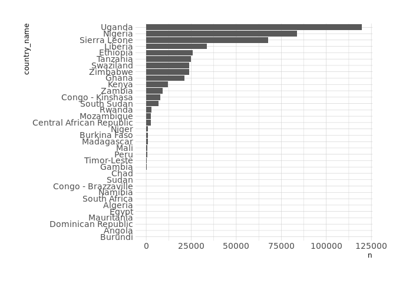

(WIP) Tidy Tuesday: Water Sources
================
Matthew Henderson
2021-05-04

``` r
library(tidytuesdayR)

tuesdata <- tt_load(2021, week = 19)
#> 
#>  Downloading file 1 of 1: `water.csv`
```

# Which countries have most reports?

``` r
library(tidyverse)

(
  p <- tuesdata$water %>%
    filter(!is.na(country_name)) %>%
    group_by(country_name) %>%
    tally() %>%
    arrange(n) %>%
    mutate(country_name = factor(country_name, levels = country_name)) %>%
    ggplot() +
      geom_col(aes(x = country_name, y = n)) +
      coord_flip()
)
```

<!-- -->

``` r
#ggsave(filename = paste0("plot1/plot_", as.numeric(Sys.time()), ".png"))
```

# When were water points installed?

``` r
(
  p <- tuesdata$water %>%
    filter(!is.na(install_year)) %>%
    group_by(install_year) %>%
    tally() %>%
    ggplot(aes(x = install_year, y = n)) +
      geom_step()
)
```

<!-- -->

``` r
#ggsave(filename = paste0("plot2/plot_", as.numeric(Sys.time()), ".png"), width = 12)
```

# When were reports made?

``` r
library(lubridate)

(
  p <- tuesdata$water %>%
    mutate(report_date = mdy(report_date)) %>%
    filter(!is.na(report_date)) %>%
    group_by(report_date) %>%
    tally() %>%
    filter(report_date > "2000-01-01") %>%
    filter(report_date < "2021-01-01") %>%
    ggplot(aes(x = report_date, y = n)) +
      geom_line() +
      scale_x_date(date_breaks = "1 year", date_labels =  "%Y")
)
```

<!-- -->

``` r
#ggsave(filename = paste0("plot3/plot_", as.numeric(Sys.time()), ".png"), width = 12)
```

# Is water available?

``` r
(
  p <- tuesdata$water %>%
    group_by(status_id) %>%
    tally() %>%
    ggplot(aes(x = status_id, y = n)) +
      geom_point()
)
```

<!-- -->

``` r
#ggsave(filename = paste0("plot4/plot_", as.numeric(Sys.time()), ".png"))
```
