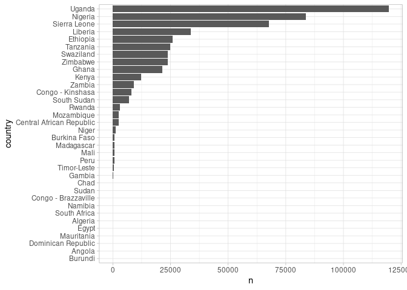
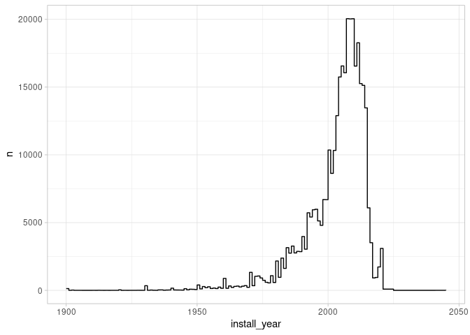
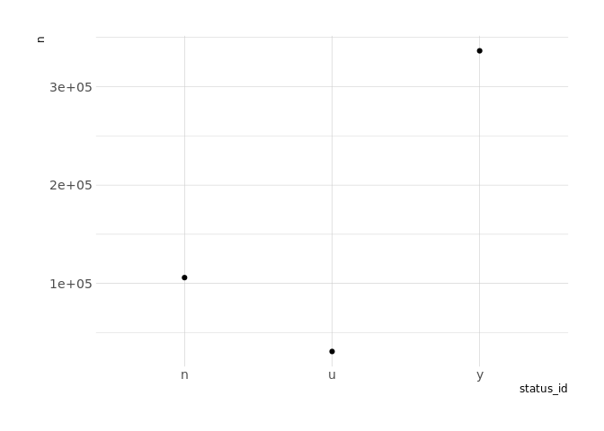
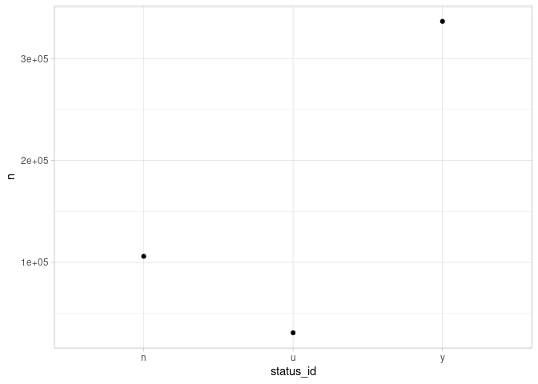
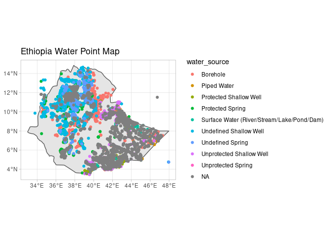
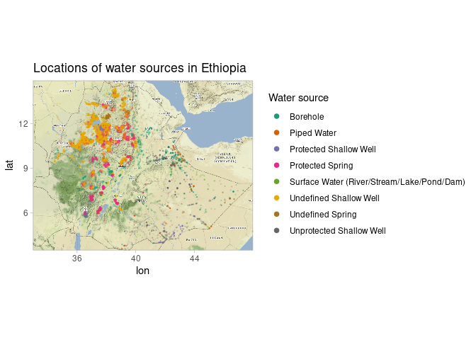

(WIP) Tidy Tuesday: Water Sources
================
Matthew Henderson
2021-05-04

``` r
library(tidytuesdayR)

tuesdata <- tt_load(2021, week = 19)
#> 
#>  Downloading file 1 of 1: `water.csv`
```

``` r
library(tidyverse)

water <- tuesdata$water %>%
  rename(
    lat = lat_deg,
    lon = lon_deg,
    country = country_name
  )
```

# Which countries have most reports?

``` r
(
  p <- water %>%
    filter(!is.na(country)) %>%
    group_by(country) %>%
    tally() %>%
    arrange(n) %>%
    mutate(country = factor(country, levels = country)) %>%
    ggplot() +
      geom_col(aes(x = country, y = n)) +
      coord_flip()
)
```

<!-- -->

``` r
#ggsave(filename = paste0("plots/plot1/plot_", as.numeric(Sys.time()), ".png"))
```

# When were water points installed?

``` r
(
  p <- water %>%
    filter(!is.na(install_year)) %>%
    group_by(install_year) %>%
    tally() %>%
    ggplot(aes(x = install_year, y = n)) +
      geom_step()
)
```

<!-- -->

``` r
#ggsave(filename = paste0("plots/plot2/plot_", as.numeric(Sys.time()), ".png"), width = 12)
```

# When were reports made?

``` r
library(lubridate)

(
  p <- water %>%
    mutate(report_date = mdy(report_date)) %>%
    filter(!is.na(report_date)) %>%
    group_by(report_date) %>%
    tally() %>%
    filter(report_date > "2000-01-01") %>%
    filter(report_date < "2021-01-01") %>%
    ggplot(aes(x = report_date, y = n)) +
      geom_line() +
      scale_x_date(date_breaks = "1 year", date_labels =  "%Y")
)
```

<!-- -->

``` r
#ggsave(filename = paste0("plots/plot3/plot_", as.numeric(Sys.time()), ".png"), width = 12)
```

# Is water available?

``` r
(
  p <- water %>%
    group_by(status_id) %>%
    tally() %>%
    ggplot(aes(x = status_id, y = n)) +
      geom_point()
)
```

<!-- -->

``` r
#ggsave(filename = paste0("plots/plot4/plot_", as.numeric(Sys.time()), ".png"))
```

# Where?

``` r
library(ggplot2)
library(rnaturalearth)
library(rnaturalearthdata)
library(sf)
library(tidyverse)

ethiopia <- ne_countries(country = "ethiopia", scale = "medium", returnclass = "sf")

ethiopia_bbox <- st_bbox(ethiopia)

ethiopia_water <- water %>%
  filter(country == "Ethiopia") %>%
  filter(lat >= ethiopia_bbox$ymin) %>%
  filter(lat <= ethiopia_bbox$ymax) %>%
  filter(lon >= ethiopia_bbox$xmin) %>%
  filter(lon <= ethiopia_bbox$xmax)
```

``` r
ethiopia_water_sf <- ethiopia_water %>%
  st_as_sf(coords = c("lon", "lat"), crs = 4326, agr = "constant")
```

``` r
ggplot() +
  geom_sf(data = ethiopia) +
  geom_sf(aes(colour = water_source), data = ethiopia_water_sf) +
  labs(
    title = "Ethiopia Water Point Map"
  )
```

<!-- -->

``` r
#ggsave(filename = paste0("plots/plot5/plot_", as.numeric(Sys.time()), ".png"))
```

# Where again?

Inspired by livestream by David Robinson.

``` r
library(ggmap)

ethiopia_map <- get_stamenmap(bbox = c(
  left = ethiopia_bbox[["xmin"]],
  right = ethiopia_bbox[["xmax"]],
  bottom = ethiopia_bbox[["ymin"]],
  top = ethiopia_bbox[["ymax"]]
), zoom = 7, maptype = "terrain")
```

``` r
ethiopia_water <- ethiopia_water %>%
  filter(!is.na(water_source)) %>%
  filter(water_source!="Unprotected Spring")

ggmap(ethiopia_map) +
  geom_point(aes(x = lon, y = lat, colour = water_source), data = ethiopia_water, size = .2, alpha = .2) +
  guides(colour = guide_legend(override.aes = list(size = 2, alpha = 1))) +
  scale_color_brewer(type = "qual", palette = "Dark2") +
  labs(
    title = "Locations of water sources in Ethiopia",
    colour = "Water source"
  )
```

<!-- -->

``` r
#ggsave(filename = paste0("plots/plot6/plot_", as.numeric(Sys.time()), ".png"))
```
